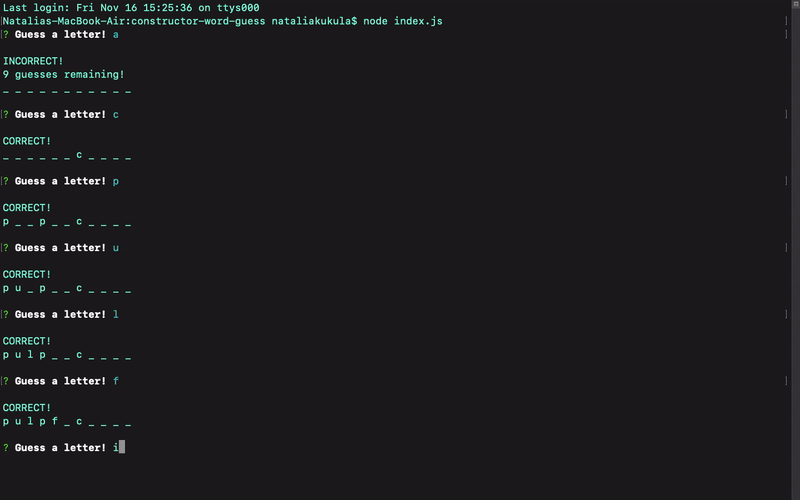

# Word Guess Command-Line Game 

**Name:** Constructor-Node-Hangman \
**Created for:** Northwestern Coding Bootcamp \
**Developer:** Natalia Kukula \
**Deployment Date:**  November 16, 2018 \
**Runtime:** Node.js\
**Command Line:** Git Bash\
**Built with:** Javascript \
**NPM:** Inquirer

## Summary
Hangman game in the CLI. 

* CLI takes in inputs by using the npm Inquirer package
* the user gets 10 chances to guess letters to uncover the hidden word
* if they guess right the CLI says _correct_
* if they guess wrong the CLI lets the user know how many guesses they have left
* the user can guess or not, and then will be given a new word to guess

## Notes:
First app utilizing constructors.
